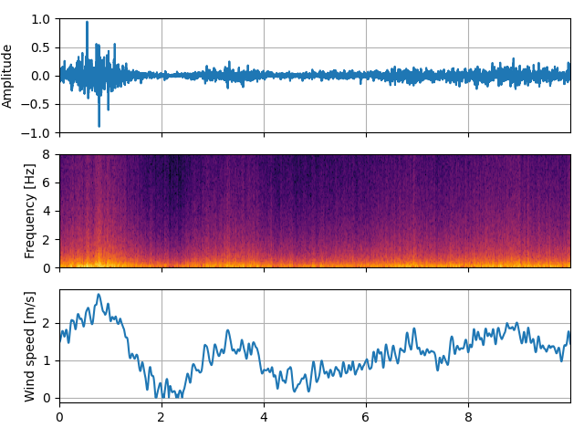

# SC-Wind-Noise-Generator

## Introduction
The SC-Wind-Noise-Generator is a Python-based framework designed to generate synthetic wind noise based on a wind speed profile. It provides a simple and flexible way to simulate wind noise for various applications, such as audio signal processing, noise reduction, audio production, video game development, and virtual reality experiences. The SC-Wind-Noise-Generator ensures that each generated sample is statistically independent from the others, allowing for realistic and varied wind noise simulations. This is particularly suitable for training deep learning-based solutions (e.g., wind noise reduction). 

Note: By wind noise, we refer to the wind turbulent pressure fluctuations that generate low-frequency rumbling sound in microphone signals, and not particularly to the aeroacoustic sound generated by wind (e.g., whistling in pipes or electric cables, rustling leaves, etc.). <br>

For sound designers and VR/game developers, we recommend setting the attribute `short_term_var=False` to simulate a more "pleasant" wind noise for your application. More details can be found in the Customization section. 

This repository contains the accompanying code of the following paper:
_______________________________________________________________________
**Simulating wind noise with airflow speed-dependent characteristics**  
*D. Mirabilii<sup>1</sup>, A. Lodermeyer<sup>1</sup>, F. Czwielong<sup>2</sup>, S. Becker<sup>2</sup> and E. A. P. Habets<sup>1</sup>*  <br>
*<sup>1</sup>International Audio Laboratories Erlangen*  <br>
*<sup>2</sup>Aerodynamics and Acoustics, Institute of Fluid Mechanics, FAU Erlangen-Nürnberg*  
in Proc. Intl. Workshop Acoust. Signal Enhancement </b>(IWAENC)</b>, Bamberg, 2022
________________________________________________________________________

For a detailed description of the fundamental methods used in the framework and for audio examples, please refer to the [webpage](https://www.audiolabs-erlangen.de/resources/2022-IWAENC-SWN).

This README file provides an overview of the framework, including its installation instructions, basic usage, and customization options.


## Installation
To use the SC-Wind-Noise-Generator, follow these steps:

1. Make sure you have Python 3.6 or later installed on your system.
2. Clone the repository from GitHub:

   ```bash
   git clone https://github.com/audiolabs/SC-Wind-Noise-Generator.git
   ```

3. Change into the project directory:

   ```bash
   cd SC-Wind-Noise-Generator
   ```

4. Install the required dependencies using pip:

   ```bash
   pip install -r requirements.txt
   ```

5. Once the dependencies are installed, you can use the framework.

## Usage
To generate synthetic wind noise, follow these steps:

1. Import the `WindNoiseGenerator` class from the framework:

   ```python
   from sc_wind_noise_generator import WindNoiseGenerator
   ```

2. Create an instance of the `WindNoiseGenerator` class using the default settings:

   ```python
   generator = WindNoiseGenerator()
   ```

3. Or set the parameters (ex. sampling frequency and duration) for which you want to generate wind noise:

   ```python
   generator = WindNoiseGenerator(fs=48000, duration=5, generate=True, wind_profile=None, gustiness=3, start_seed=None)
   ```
   (see Customization for further details) <br>
4. Generate the wind noise waveform and the wind speed profile (if not user-defined):

   ```python
   waveform, wind_profile = generator.generate_wind_noise()
   ```

5. You can now use the generated `waveform` for further processing or save it to a file:
  ```python
  generator.save_signal(waveform)
  ```
  
  6. You can also plot the waveform and the wind profile: 

  ```python
  generator.plot_signals(waveform, wind_profile)
  ```
  
<p align="center">
  
</p>
The repo contains a basic example `generate_example.py` that generates wind noise with a specific wind speed profile, saves to a .wav file, and plot the result. 

## Customization
The `WindNoiseGenerator` class provides various customization options to tailor the wind noise generation to your specific needs. Change the attribute's value according to the following description.  

- Attributes:
  - `fs` sampling frequency in Hz. The framework works at 48 kHz, but if a different sampling frequency is selected, the final waveform is automatically resampled.
  - `duration` duration in seconds of the generated wind noise sample.
  - `generate` boolean for automatically generating the wind speed profile (if True, the user-defined wind speed profile attribute is ignored).
  - `wind_profile` user-defined numpy array that contains wind speed values over time (to use it, `generate=False`).
  - `gustiness` parameter to change how often the wind speed changes over time if `generate=True`. For example, `gustiness=1` yields constant wind speed, and `gustiness=10` yields highly-variable wind speed over the duration of the sample. Ignored if `generate=False`.
  - `short_term_var` set to True if you want to simulate distortions created by turbulent pressure fluctuations (suggested for, e.g., wind noise reduction purposes), or False to generate a smoother sound (suggested for, e.g., sound designers, and VR/game developers).
  - `start_seed` set to None to generate different and independent realizations of wind noise, even when the same attributes (e.g., the wind speed profile) are selected. Otherwise, choose an integer number to generate reproducible wind noise samples. 

Here are some examples of available methods:

- Play generated wind noise signal:
  - Use the `play_signal` method to play the generated wind noise signal.


- Save generated wind noise signal:
  - Use the `save_signal` method to save the generated wind noise signal with a specific name and location.
  - Parameters: `filename` path and file name, `print_log` print message of successful save, `num_ch` 1 for mono and 2 for "stereo" (copy of the sample on both left and right channels), `fs` sampling frequency
  - Example: 
  ```python
  generator.save_signal(waveform, filename='wind_noise.wav', num_ch=1, fs=16000)
  ```

- Plot generated wind noise signal:
   - Use the `plot_signal` method to plot the generated wind noise signal waveform, spectrogram and the associated wind speed profile.
   - Example: 
  ```python
  generator.plot_signals(waveform, wind_profile)
  ```
The basic functionality of the framework is shown in `generate_example.py`, which generates wind noise with a specific wind speed profile, saves it to a .wav file, and plot the result. Please refer to the documentation or source code for more details on customization options and available methods. 

## Contributing
If you encounter any issues, have suggestions for improvements, or would like to add new features, please submit an issue on GitHub or contact the maintainers. 

## License
The SC-Wind-Noise-Generator is licensed under the MIT License. See the [LICENSE](LICENSE) file for more information.

## Contact
If you have any questions, suggestions, or feedback, please contact the project maintainers:

- Daniele Mirabilii [danielemirabilii@gmail.com](danielemirabilii@gmail.com)
- Emanuël Habets [emanuel.habets@audiolabs-erlangen.de](emanuel.habets@audiolabs-erlangen.de)